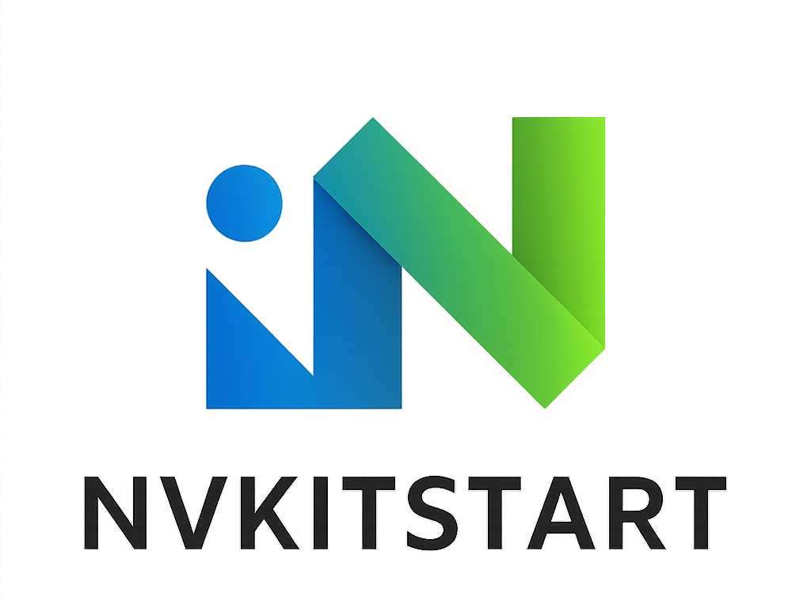

  

# NvKitstart

NvKitstart is a modern, object-oriented Neovim starter configuration written in Lua.  
It features modular plugin management via [lazy.nvim](https://github.com/folke/lazy.nvim), sensible defaults, and clear extension points for easy customization and contribution.

---

## Features

- **OOP-style Lua structure** for maintainability and extensibility
- **Plugin management** with [lazy.nvim](https://github.com/folke/lazy.nvim)
- **Fast startup** and automatic bootstrapping
- **LSP, completion, formatting, file explorer, statusline, colorschemes**, and more
- **Easy to add, update, or remove plugins**
- **Contributor-friendly** with clear inline comments and [CONTRIBUTING.md](./CONTRIBUTING.md)
- **MIT licensed**

---

## Plugin List

The following plugins are included and managed automatically:

- **[neovim/nvim-lspconfig](https://github.com/neovim/nvim-lspconfig)** - Native LSP configuration
- **[saghen/blink.cmp](https://github.com/saghen/blink.cmp)** - Fast completion engine with snippet support
- **[iamcco/markdown-preview.nvim](https://github.com/iamcco/markdown-preview.nvim)** - Live Markdown preview in browser
- **[stevearc/conform.nvim](https://github.com/stevearc/conform.nvim)** - Lightweight formatting engine
- **[mason-org/mason.nvim](https://github.com/mason-org/mason.nvim)** - LSP server and tool installer
- **[nvim-treesitter/nvim-treesitter](https://github.com/nvim-treesitter/nvim-treesitter)** - Advanced syntax highlighting and code parsing
- **[stevearc/oil.nvim](https://github.com/stevearc/oil.nvim)** - Modern file explorer
- **[mason-org/mason-lspconfig.nvim](https://github.com/mason-org/mason-lspconfig.nvim)** - Bridges mason.nvim with lspconfig
- **[romgrk/barbar.nvim](https://github.com/romgrk/barbar.nvim)** - Buffer management with visual tabs
- **[nvim-telescope/telescope.nvim](https://github.com/nvim-telescope/telescope.nvim)** - Fuzzy finder for files, grep, and more
- **[folke/which-key.nvim](https://github.com/folke/which-key.nvim)** - Keymap discovery and helper
- **[nvim-mini/mini.nvim](https://github.com/nvim-mini/mini.nvim)** - Collection of small, focused plugins (icons, statusline, indentscope)
- **[folke/noice.nvim](https://github.com/folke/noice.nvim)** - Enhanced UI for messages, cmdline, and popupmenu
- **[zaldih/themery.nvim](https://github.com/zaldih/themery.nvim)** - Theme switcher UI
- **[folke/tokyonight.nvim](https://github.com/folke/tokyonight.nvim)** - Beautiful Tokyo Night colorscheme

---

## Getting Started

1. **Requirements**
    - [Neovim](https://neovim.io/) 0.9 or newer
    - [git](https://git-scm.com/)
    - [ripgrep](https://github.com/BurntSushi/ripgrep)
    - [node](https://nodejs.org/en) (Optional, for [markdown-preview.nvim](https://github.com/iamcco/markdown-preview.nvim) plguin.)

2. **Installation**
    - Copy `init.lua` into your Neovim config folder:
      - `~/.config/nvim/init.lua` (Linux/macOS)
      - `%USERPROFILE%\AppData\Local\nvim\init.lua` (Windows)
    - Start Neovim – plugins will bootstrap and install automatically!

3. **First Run**
    - NvKitstart will automatically install [lazy.nvim](https://github.com/folke/lazy.nvim) if it is missing.
    - All included plugins and LSP servers will be managed for you.

4. **Managing LSP Servers**
    The configuration includes `mason.nvim` and `mason-lspconfig.nvim` for easy LSP server management:
    - To install a language server: `:LspInstall <server_name>`
      - Examples: `:LspInstall pyright` (Python), `:LspInstall tsserver` (TypeScript/JavaScript)
    - To view all available servers: `:Mason`
    - Servers configured to install automatically: `lua_ls`, `rust_analyzer`, `clangd`

---

## Keymaps

NvKitstart comes with predefined keymaps using the `<leader>` key (set to Space):

### General
- **`<leader>?`** - Show buffer-local keymaps (which-key)

### Telescope (File Operations)
- **`<leader>ff`** - Find files
- **`<leader>fg`** - Live grep
- **`<leader>fb`** - Buffers
- **`<leader>fh`** - Help tags
- **`<leader>fd`** - Diagnostics
- **`<leader>ft`** - Telescope main menu

### Barbar (Buffer Management)
- **`<leader>b,`** / **`<leader>b.`** - Previous/Next buffer
- **`<leader>b1-9`** - Go to buffer 1-9
- **`<leader>b0`** - Go to last buffer
- **`<leader>bc`** - Close buffer
- **`<leader>bw`** - Wipeout buffer
- **`<leader>bp`** - Pin/unpin buffer
- **`<leader>bP`** - Magic buffer pick mode

### File Explorer & Themes
- **`<leader>fo`** - Open Oil file explorer
- **`<leader>ft`** - Open Themery theme selector

> **Note**: All keymaps can be customized by editing `InitWhichKeyMappings()` in `init.lua`.

---

## Configuration

### LSP & Completion
- LSP is configured via `nvim-lspconfig` with `mason.nvim` for automatic server management
- Autocompletion powered by `blink.cmp` with LSP, path, snippets, and buffer sources
- Diagnostics appear as floating windows on hover (no virtual text)

### Formatting
- `conform.nvim` handles formatting with `:Format` command
- Currently configured for Lua (stylua) - extend `formatters_by_ft` for other languages
- Auto-formats on save by default

### Treesitter
- Ensures installed: `c`, `cpp`, `java`, `javascript`, `html`, `css`, `typescript`, `lua`, `vim`, `markdown`
- Automatic installation enabled

### Appearance
- Theme switcher: `:Themery` or `<leader>ft`
- Pre-configured themes: Tokyo Night (Moon, Storm, Night, Day)
- Icons in ASCII style for compatibility

---

## Customization

- **Add/Remove Plugins:**  
  Edit the `setup_plugins()` method in `init.lua` to modify plugin specs.

- **Change Options:**  
  Edit the `set_options()` method to change editor settings.

- **Add Keymaps:**  
  Add keymaps by extending `InitWhichKeyLocalMappings()` or `InitWhichKeyBarbarMappings()`.

- **Diagnostics & More:**  
  Extend `setup_diagnostics()` for custom diagnostics.

See [CONTRIBUTING.md](./CONTRIBUTING.md) for detailed guidelines.

---

## Troubleshooting

### Plugin installation fails
- Ensure `git` is installed and accessible
- Delete `~/.local/share/nvim/lazy` and restart Neovim

### LSP server not working
- Run `:LspInfo` to check LSP status
- Install missing servers via `:Mason`
- Check `:checkhealth vim.lsp` for LSP health

### Colorscheme not loading
- Run `:Themery` to select a theme
- Ensure `tokyonight.nvim` is installed (should be automatic)

---

## Contributing

Pull requests, issues, and suggestions are welcome!  
Please read [CONTRIBUTING.md](./CONTRIBUTING.md) before submitting major changes.

---

## License

MIT License. See [LICENSE](./LICENSE).

---

## Credits

- [lazy.nvim](https://github.com/folke/lazy.nvim) (plugin manager)
- All referenced plugins – see `init.lua` for full list

---

## Screenshots

---
## Questions?

Open an [issue](https://github.com/BillyBoyMF/NvKitstart/issues) or start a discussion!
